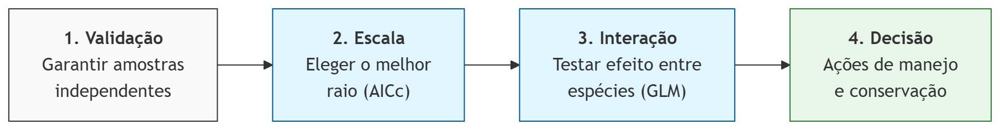

::: callout-caution
## Capítulo em Desenvolvimento

⚠️ **Aviso:**

Este capítulo é um trabalho em andamento. Os exemplos de código e o texto ainda estão sendo refinados. Você pode encontrar alguns espaços em branco, rascunhos, erros gramaticais, mas estou trabalhando ativamente para finalizá-lo. Feedbacks e sugestões são sempre bem-vindos!
:::

## Introdução

```{r}
#| label: fig-processo
#| echo: false
#| message: false
#| warning: false
#| out-width: "100%"
#| fig-cap: "Fluxo metodológico para análise multiescalar. O processo inicia na validação estatística da distribuição (1), passa pela identificação da escala de efeito do ambiente (2), isola as interações bióticas entre as espécies (3) e culmina na interpretação para tomada de decisão no mundo real (4)."

# knitr grabs the image that was generated in mermaid

```


A ecologia de paisagens urbana investiga como a configuração e a composição do habitat influenciam a biodiversidade. No contexto amazônico, áreas como o Campus Marco Zero da UNIFAP (Macapá, Brasil) representam mosaicos complexos onde a fauna doméstica (*Canis familiaris* e *Felis catus*) interage com fragmentos remanescentes de cerrado.

Um conceito central aqui é a **Escala de Efeito**: a escala espacial na qual a relação entre a estrutura da paisagem e a resposta biológica é mais forte. Este capítulo demonstra como identificar essa escala e analisar a coocorrência dessas espécies usando R.

## Configuração do Ambiente e Dados

Utilizaremos o ecossistema `tidyverse` para manipulação, `sf` para dados espaciais e pacotes de modelagem estatística.

```{r}
#| label: packages-map
#| message: false
#| warning: false

# 1. Spatial Engines
library(terra)
library(sf)
library(spdep)

# 2. Data Manipulation & Grammar
library(tidyverse)
library(broom)

# 3. Analytical Models
library(MuMIn) # Para comparação de modelos
library(cooccur) 
library(CooccurrenceAffinity)

# 4. Cartography & Visualization
library(patchwork)   # Para organizar gráficos
```

Dados

```{r}
#| label: dados-animais
#| message: false
#| warning: false

# Ler o arquivo com metricas
metricas <- read.csv("data/tabela_metricas_final.csv")
# Ler o arquivo com presença-ausença
especies <- read.csv("data/ep_species_pa.csv")
# Limpeza e padronização de IDs
especies <- especies |> 
  rename(plot_id = instal_ponto)
```

Preparação da Paisagem As métricas calculadas via landscapemetrics precisam ser organizadas. Focaremos na métrica pland (porcentagem da classe) para a classe "uso humano", que é frequentemente um preditor forte para espécies domésticas.

```{r}
#| label: prep-dados
#| message: false
#| warning: false

# Filtrando a métrica PLAND para áreas de Uso Humano
df_pland_humano <- metricas |>
  tidyr::complete(plot_id, metric, class_3, escala_buffer, fill = list(value = 0)) |>
  filter(metric == "pland", class_3 == "uso humano") |>
  select(plot_id, escala_buffer, value) |> 
  rename(pland_humano = value)

# Preparação: Deixando os dados em formato "longo" (uma coluna para espécie)
# Isso permite agrupar tudo de uma vez só!
df_longo <- especies |>
  select(plot_id, calu, feca) |>
  pivot_longer(cols = c(calu, feca), names_to = "especie", values_to = "presenca") |>
  left_join(df_pland_humano, by = "plot_id")

```

## Análise da Escala de Efeito

### Autocorrelação Espacial

A autocorrelação espacial deve ser avaliada primeiro porque ela viola o pressuposto fundamental de independência das observações, o que pode inflar artificialmente a significância estatística (gerando falsos positivos) e distorcer a compreensão dos reais processos que estruturam a paisagem. Para analises precisamos uma objeto com estrutura espacial. O codigo abixo tranformar uma tabela de dados em arquivo espacial.

```{r}
#| label: make-sf
#| message: false
#| warning: false

# Converter para objeto espacial (sf) e projetar para UTM 22S 
# Usamos EPSG:31982 (SIRGAS 2000 / zone 22S) para distâncias em metros
dados_sf <- especies |>
  st_as_sf(coords = c("lon_x", "lat_y"), crs = 4326) |>
  st_transform(crs = 31982)
```

Para avaliar o desenho amostral, calculamos a distância até o vizinho mais próximo (k=1) utilizando as coordenadas projetadas das armadilhas.

```{r}
#| label: make-nn
#| message: false
#| warning: false
# 1. Encontrar o 1º vizinho mais próximo (k = 1)
vizinhos_nn <- knearneigh(st_coordinates(dados_sf), k = 1)

# 2. Converter para objeto de vizinhança (nb)
nb_nn <- knn2nb(vizinhos_nn)

# 3. Extrair as distâncias reais (em metros) entre os pares
# nbdists retorna uma lista, por isso usamos unlist() para ter um vetor numérico
dist_nn <- unlist(nbdists(nb_nn, st_coordinates(dados_sf)))

# 4. Estatísticas 
nnd_mean <- mean(dist_nn)
nnd_min  <- min(dist_nn)
nnd_max  <- max(dist_nn)
```

Em média, cada estação de monitoramento está a `r round(nnd_mean, 1)` metros de sua vizinha mais próxima. A menor distância encontrada entre duas estações foi de `r round(nnd_min, 1)` metros, enquanto a maior distância para o primeiro vizinho foi de `r round(nnd_max, 1)` metros.

Do ponto de vista técnico, como a menor distância é de `r round(nnd_min, 1)` m, raios de extração de paisagem acima de `r round(nnd_min / 2, 1)` m resultam em sobreposição (overlap) das áreas medidas, o que deve ser considerado na interpretação dos modelos multiescalares.

Para verificar se a proximidade das armadilhas fotográficas influenciava os registros, aplicamos o teste de Autocorrelação Espacial de Moran I.

```{r}
#| label: test-moran
#| message: false
#| warning: false

# Definir a matriz de vizinhança
# Para N pequeno (17), vamos usar KNN (K-Nearest Neighbors, 
# com k=3 (cada ponto é comparado aos 3 vizinhos mais próximos)
vizinhos <- knearneigh(st_coordinates(dados_sf), k = 3)
nb <- knn2nb(vizinhos)
pesos <- nb2listw(nb, style = "W") # Estilo 'W' é padronizado por linha

# Executar o Teste de I de Moran para Cães (calu) e Gatos (feca)
moran_caes <- moran.test(especies$calu, pesos)
moran_gatos <- moran.test(especies$feca, pesos)

# Ver os resultados
print(moran_caes)
print(moran_gatos)

```

Para ambas as espécies, o p-valor é maior que 0,05 (Cães: p=0,36; Gatos: p=0,15), portanto não podemos rejeitar a hipótese nula de aleatoriedade espacial.

```{r}
#| label: fig-moran-gg
#| fig-cap: "Gráfico de dispersão de Moran (Moran Plot) para a ocorrência de cães (A) e gatos (B) no Campus Marco Zero. O eixo horizontal representa os valores observados de presença (1) ou ausência (0) em cada estação de monitoramento. O eixo vertical representa o lag espacial, que corresponde à média ponderada da ocorrência nos três vizinhos mais próximos (k=3). A linha sólida representa a inclinação da regressão, cujo coeficiente equivale ao Índice de Moran (I). As linhas tracejadas indicam as médias aritméticas da variável e do seu respectivo lag espacial."
#| message: false
#| warning: false
#| fig-width: 9
#| fig-asp: 0.5

# 1. Calcular o lag espacial manualmente e adicionar ao dataframe
dados_plot <- dados_sf %>%
  mutate(
    lag_calu = lag.listw(pesos, calu),
    lag_feca = lag.listw(pesos, feca)
  )

# 2. Criar o gráfico para Cães
p1 <- ggplot(dados_plot, aes(x = calu, y = lag_calu)) +
  geom_jitter(size = 3, width = 0.05, height = 0.05, alpha = 0.6) +
  geom_smooth(method = "lm", color = "black", se = FALSE) + # Reta de Moran
  geom_hline(yintercept = mean(dados_plot$lag_calu), linetype = "dashed", alpha = 0.5) +
  geom_vline(xintercept = mean(dados_plot$calu), linetype = "dashed", alpha = 0.5) +
  coord_cartesian(ylim = c(0, 1.05)) +
  labs(title = "(A) Cães", x = "Ocorrência (Cães)", y = "Lag Espacial") +
  theme_bw()

# 3. Criar o gráfico para Gatos
p2 <- ggplot(dados_plot, aes(x = feca, y = lag_feca)) +
  geom_jitter(size = 3, width = 0.05, height = 0.05, alpha = 0.6) +
  geom_smooth(method = "lm", color = "black", se = FALSE) + # Reta de Moran
  geom_hline(yintercept = mean(dados_plot$lag_feca), linetype = "dashed", alpha = 0.5) +
  geom_vline(xintercept = mean(dados_plot$feca), linetype = "dashed", alpha = 0.5) +
  coord_cartesian(ylim = c(0, 1.05)) +
  labs(title = "(B) Gatos", x = "Ocorrência (Gatos)", y = "Lag Espacial") +
  theme_bw()

# 4. Unir os gráficos com patchwork
p1 + p2
```

O que isso significa na pratica? Isso valida o uso de modelos estatísticos simples (como ANOVA, GLM etc). Como não há autocorrelação espacial significativa, os resíduos dos modelos são independentes, e você não precisa de modelos complexos para "corrigir" a proximidade das câmeras. Para os cães, o Índice de Moran foi próximo de zero (I=−0,007; p=0,36), o que é visualizado na @fig-moran-gg pela linha de regressão praticamente horizontal. Isso indica que a presença de um cão em uma estação não está correlacionada à sua presença nas estações vizinhas. Para os gatos (@fig-moran-gg), observou-se uma inclinação levemente positiva (I=0,10), sugerindo uma tendência sutil de agrupamento, embora estatisticamente não significativa (p=0,15).

Para garantir a robustez da nossa análise com 17 estações, utilizamos o teste de Monte Carlo (moran.mc) no proximo bloco de codigo. Em vez de confiar em fórmulas matemáticas ideais (por exemplo o moran.test assume que os dados seguem uma distribuição normal, o que raramente é verdade para presença/ausência), este teste embaralha nossos dados 999 vezes para criar um 'cenário de acaso' customizado para o Campus Marco Zero.

Ele pega os 17 valores de cães/gatos, mantém a localização das câmeras fixa, e "embaralha" os valores entre elas centenas de vezes (ex: 999 vezes). Para cada embaralhamento, ele calcula o I de Moran. Isso cria uma distribuição nula (o que seria o acaso). O moran.mc não retorna um "CI do valor observado". Ele retorna onde o seu valor observado está em relação a todos os valores possíveis ao acaso. No entanto, você pode calcular os quantis dessa simulação para dizer: "95% das vezes, o acaso gera valores de Moran entre X e Y". Se o seu valor observado estiver fora desse intervalo, ele é significativo (registros apresentem Autocorrelação Espacial).

```{r}
#| label: fig-spat-auto
#| fig-cap: "Resultados da simulação de Monte Carlo (999 permutações) para o Índice de Moran da ocorrência de cães e gatos no Campus Marco Zero. A área sombreada em cinza representa a distribuição nula do Índice de Moran, ou seja, o padrão esperado caso a distribuição das espécies fosse puramente aleatória no espaço. A linha vertical tracejada indica a expectativa teórica para a ausência de autocorrelação (I≈−0,06 para n=17). As linhas verticais pontilhadas representa quantis de 95% para a distribuição nula."
#| message: false
#| warning: false
#| fig-width: 9
#| fig-asp: 0.5

# Simulação de Monte Carlo (999 permutações)
set.seed(123)
mc_caes <- moran.mc(dados_sf$calu, pesos, nsim = 999)
mc_gatos <- moran.mc(dados_sf$feca, pesos, nsim = 999)

res_caes <- data.frame(moran_i = mc_caes$res,
  obs_i = mc_caes$statistic,
  p_val = mc_caes$p.value
 ) 
res_gatos <- data.frame(moran_i = mc_gatos$res,
  obs_i = mc_gatos$statistic,
  p_val = mc_gatos$p.value
 ) 
# Calcular os quantis de 95% para a distribuição nula
q_caes <- quantile(res_caes$moran_i, probs = c(0.025, 0.975))
q_gatos <- quantile(res_gatos$moran_i, probs = c(0.025, 0.975))
expectativa <- -1 / (17 - 1) 

fig_m_cao <- ggplot(res_caes, aes(x = moran_i)) +
    geom_density(fill = "grey90", color = "grey40") +
  # Intervalo de 95% da distribuição nula (Quantis)
    geom_vline(xintercept = q_caes, color = "grey50", linetype = "dotted", linewidth = 0.8) +
    # Linha do valor observado
    geom_vline(aes(xintercept = obs_i), color = "#0072B2", 
               linetype = "solid", linewidth = 1.2) +
    # Linha da expectativa (acaso)
    geom_vline(aes(xintercept = expectativa), 
               color = "black", linetype = "dashed", 
               linewidth = 1.0) +
    annotate("label", x = res_caes$obs_i, y = 1.5, 
             label = paste("Observed I:", round(res_caes$obs_i, 3)), 
             fill = "white",        # Cor do fundo do box
             alpha = 0.7,           # Transparência do box (0 a 1)
             label.size = 0.5,      # Espessura da borda do box
             vjust = 2, 
             color = "#0072B2", 
             fontface = "bold", angle = 90, size = 4) +
    labs(title = "Simulação Monte Carlo - Cães",
         subtitle = paste("Permutações: 999 | p-valor:", round(res_caes$p_val, 3)),
         x = "Índice de Moran (I)",
         y = "Densidade") +
    theme_bw()

fig_m_gato <- ggplot(res_gatos, aes(x = moran_i)) +
    geom_density(fill = "grey90", color = "grey40") + 
      # Intervalo de 95% da distribuição nula (Quantis)
    geom_vline(xintercept = q_gatos, color = "grey50", linetype = "dotted", linewidth = 0.8) +
    # Linha do valor observado
    geom_vline(aes(xintercept = obs_i), color = "#D55E00", 
               linetype = "solid", linewidth = 1.2) +
    # Linha da expectativa (acaso)
    geom_vline(aes(xintercept = expectativa), 
               color = "black", linetype = "dashed", 
               linewidth = 1.0) +
    annotate("label", x = res_gatos$obs_i, y = 1.5, 
             label = paste("Observed I:", round(res_gatos$obs_i, 3)), 
             fill = "white",        # Cor do fundo do box
             alpha = 0.7,           # Transparência do box (0 a 1)
             label.size = 0.5,      # Espessura da borda do box
             vjust = 2, 
             color = "#D55E00", 
             fontface = "bold", angle = 90, size = 4) +
    labs(title = "Simulação Monte Carlo - Gatos",
         subtitle = paste("Permutações: 999 | p-valor:", round(res_gatos$p_val, 3)),
         x = "Índice de Moran (I)",
         y = "Densidade") +
    theme_bw()

fig_m_cao + fig_m_gato
```

Na Figura @fig-spat-auto, a área cinza representa todas as possibilidades de organização espacial que poderiam ocorrer por puro acaso no Campus. Note que tanto para cães quanto para gatos, a linha sólida (nosso dado real) cai dentro dessa zona de densidade cinza. Isso prova visualmente que os nossos registros presença-ausença de fauna não apresentam um padrão espacial de agrupamento ou segregação; eles são indistinguíveis do acaso (padrão aleitoria) na escala estudada.

### Cooccorencias

Agora que sabemos que os 17 pontos podem ser considerados espacialmente independentes, podemos realizar testes estatísticos para a escala do efeito. Aqui, demonstraremos o processo e as etapas utilizando a presença ou ausência de gatos e cães. Primeiramente vamos verificar padrões entre os pontos usando duas tecnicas complementares. Inicialmente, utilizamos o modelo probabilístico de coocorrência de espécies desenvolvido por Veech (2013), implementado por meio do pacote *cooccur*. Essa abordagem foi escolhida em detrimento das permutações tradicionais de modelos nulos por fornecer uma solução exata, a qual é mais estável para conjuntos de dados menores (N=17), nos quais a aleatorização pode resultar em alta variância. Aplicamos um limiar de filtragem (*thresh* = TRUE) para excluir pares de espécies com poder estatístico insuficiente para atingir significância, garantindo que as classificações como "Aleatório" não fossem meros artefatos decorrentes da raridade. Em segundo lugar, para lidar com o "viés de prevalência" inerente a espécies comuns (por exemplo, *Canis lupus* e *Felis catus*) e para quantificar a magnitude das associações, utilizamos o pacote *CooccurrenceAffinity*. Enquanto o modelo de Veech fornece uma classificação categórica (Positiva, Negativa ou Aleatória), o modelo de Afinidade fornece uma métrica da força da associação — a Estimativa de Máxima Verossimilhança (MLE) do parâmetro Alfa — e seus respectivos intervalos de confiança de 95%. Ao contrário de índices de similaridade tradicionais, como Jaccard ou Sørensen, a métrica Alfa é menos sensível à prevalência das espécies, permitindo-nos distinguir entre associações biológicas e altas taxas de coocorrência impulsionadas exclusivamente pela elevada abundância das espécies na área de estudo.

Preparação e analises de dados.

```{r}
#| label: prep-co
#| eval: false
#| message: false
#| warning: false

species_matrix <- especies |>
  select(plot_id, calu:hosa) |>           # Keep only site names and species
  pivot_longer(-plot_id,                   # Turn species columns into a single column
               names_to = "species", 
               values_to = "presence") |>
  pivot_wider(names_from = plot_id,        # Turn site rows into columns
              values_from = presence) |>
  column_to_rownames("species") 
# aqui somente gatos e caes
domestic <- species_matrix[c(1,2), ]
domestic

# cooccur modelo probabalistica Veech 2013
cooc_results <- cooccur(domestic, type = "spp_site", 
                        spp_names = TRUE, 
                        thresh = TRUE)
# Summary and significant pairs
summary(cooc_results)
#View P-values and probabilities
prob_table <- prob.table(cooc_results) 
print(prob_table)

# Affinity
affinity_res <- affinity(data = domestic, row.or.col = "row")
print(head(affinity_res$all))

```

Na ecologia, quando duas espécies são muito comuns, elas coocorrem frequentemente simplesmente porque estão em toda parte, e não necessariamente porque "gostam" uma da outra. Os resultados complementares mostraram que no Campus Marco Zero a presença de cães não prediz a presença de gatos, e vice-versa. No 17 pontos do Campus Marco Zero, gatos e cachorros apresentou um padrão de coocorrência aleatório (Modelo Probabilístico de Veech, p \> 0,05). Embora as espécies tenham compartilhado 11 dos 17 locais, a coocorrência observada (11) não diferiu significativamente dos 10,71 locais esperados ao acaso. Apesar dos elevados índices de similaridade (Jaccard = 0,688), a associação (Alpha MLE = 0,567) não foi estatisticamente significativa, uma vez que o intervalo de confiança de 95% incluiu o valor zero (95% IC: -0,268 a 1,401\]; isso sugere que a alta taxa de coocorrência decorre de sua elevada prevalência na área de estudo, e não de uma atração biológica ou de uma exigência de habitat compartilhada.

### Escalas diferentes

Os resultados da seção anterior nos trazem uma revelação importante: no Campus Marco Zero, cães e gatos não parecem estar 'brigando por espaço' ou se evitando ativamente; a presença de um não prediz a ausência do outro. No entanto, isso não significa que a distribuição deles seja aleatória em relação ao espaço. Se a interação biótica direta (espécie-espécie) é fraca, o foco do ecólogo deve mudar para a interação espécie-ambiente. Mas aqui surge um novo desafio: um gato percebe o ambiente da mesma forma que um cão? Um animal percebe o impacto da urbanização em um raio de 10 metros ou de 100 metros? Para descobrir isso, precisamos investigar a Escala de Efeito. Nesta seção, deixaremos de perguntar 'quem está com quem' para perguntar 'em qual distância o ambiente urbano realmente dita a regra' para cada espécie.

Para identificar a escala de efeito, testamos a ocorrência da espécie contra a métrica da paisagem em diferentes buffers (12.5m, 25m, 50m, 100m). A escala com o menor AIC (Akaike Information Criterion) é considerada a escala de efeito.

```{r}
#| label: scale-effect
#| message: false
#| warning: false

# 1. O Fluxo Nest-Map-Unnest (O "Coração" da análise)
# Imagine isso como: Agrupar -> Criar Gavetas -> Rodar Modelo -> Tirar da Gaveta
resultados_modelos <- df_longo |>
  group_by(especie, escala_buffer) |>
  nest() |> # Cria uma "gaveta" (list-column) para cada combinação
  mutate(
    # Aplicamos o GLM dentro de cada gaveta
    modelo = map(data, ~glm(presenca ~ pland_humano, data = .x, family = binomial)),
    # Usamos o broom::glance para extrair estatísticas básicas
    resumo = map(modelo, glance),
    # Adicionamos o AICc manualmente usando o MuMIn
    aicc = map_dbl(modelo, MuMIn::AICc)
  ) |>
  unnest(resumo) |> # Transforma as estatísticas do broom em colunas
  group_by(especie) |>
  mutate(limiar = min(aicc) + 2) |> 
  ungroup()

```

Agora comparação dos resultados.

```{r}
#| label: fig-scale-effect
#| fig-cap: "Identificação da escala de efeito para a ocorrência de cães (Canis familiaris) e gatos (Felis catus) em relação à porcentagem de áreas de uso humano (métrica PLAND) no Campus Marco Zero da UNIFAP, Macapá-AP. As curvas representam a variação do Critério de Informação de Akaike corrigido (AICc) em quatro escalas espaciais (raios de 12.5, 25, 50 e 100 metros). A linha horizontal tracejada indica o limiar de parcimônia (ΔAICc≤2); modelos abaixo desta linha são considerados são considerados estatisticamente equivalentes em termos das informações que contêm."
#| message: false
#| warning: false
#| fig-width: 9
#| fig-asp: 0.5

resultados_modelos |> 
  mutate(especie = ifelse(especie == "calu", "Cães", "Gatos")) |>
  ggplot(aes(x = escala_buffer, y = aicc)) +
  geom_line(aes(color = especie), linewidth = 1.8) + 
  geom_point(aes(fill = especie), size = 6, shape = 21) +
  geom_hline(aes(yintercept = limiar), linetype = "dashed") + 
  scale_color_manual(values = c("Cães" = "#0072B2", "Gatos" = "#D55E00")) +
  scale_fill_manual(values = c("Cães" = "#0072B2", "Gatos" = "#D55E00")) +
  facet_wrap(~ especie, scales = "free_y") +
  labs(title = "Escala de Efeito", x = "Raio (m)", y = "AICc") +
  theme_bw() + 
  theme(legend.position = "none")
```

Observa-se na @fig-scale-effect que a ocorrência de cães é melhor explicada por processos locais (12.5 a 50 m), enquanto a ocorrência de gatos responde de forma mais forte à paisagem em uma escala mais ampla (100 m). Lembre-se de que o AIC compara modelos, não diz se o melhor modelo é valido ou se as tendências são relevantes.

Uma vez identificada a escala de efeito — ou seja, a distância na qual cães e gatos melhor respondem à pressão urbana (@fig-scale-effect) — torna-se fundamental questionar se essa distribuição é moldada exclusivamente pelo ambiente físico ou se as espécies influenciam diretamente a presença uma da outra. Na ecologia de paisagens urbanas, o habitat pode ser favorável, mas a presença de um potencial competidor ou predador pode atuar como um filtro adicional para a ocorrência de uma espécie. Para investigar isso, deixamos de olhar apenas para a relação 'indivíduo-paisagem' e passamos a analisar a 'interação biótica multiescalar'. No proximo bloco de codigo, exploramos se a presença de cães exerce algum efeito de atração ou repulsa sobre a ocorrência de gatos em cada um dos raios estudados, permitindo-nos entender se a coexistência no Campus Marco Zero é ditada por comportamentos de exclusão ou se ambos estão apenas respondendo de forma independente aos recursos oferecidos pela matriz antrópica.

Para gerar a análise de interação multiescalar, seguimos três etapas principais no R. Primeiro, unificamos em um único banco de dados os registros de presença de cães e gatos com as métricas de paisagem calculadas para cada escala. Em seguida, aplicamos um Modelo Linear Generalizado (GLM) para cada um dos raios de monitoramento. Diferente dos modelos anteriores, aqui a presença do gato é a variável resposta, enquanto a presença do cão e a porcentagem de uso humano entram como variáveis explicativas. Abaixo, utilizamos a lógica de 'empacotar' os dados por escala (função nest) e aplicar o modelo de forma automatizada (função map). O objetivo é extrair o coeficiente de inclinação (log-odds) que indica a força da relação entre as duas espécies. Se o intervalo de confiança desse coeficiente cruzar a linha do zero, concluiremos que a presença de uma espécie não dita a ocorrência da outra naquela escala específica. O código a seguir demonstra como organizar esses modelos e preparar os dados para a visualização final:

```{r}
#| label: fig-effect-co
#| fig-cap: "Análise multiescalar da interação biótica entre cães e gatos no Campus Marco Zero da UNIFAP, Macapá-AP. Os pontos representam as estimativas de inclinação (coeficientes Log-odds) da presença de cães sobre a probabilidade de ocorrência de gatos, controladas estatisticamente pela porcentagem de áreas de uso humano (métrica PLAND). As barras verticais indicam os intervalos de confiança (IC) de 95%. A linha tracejada vermelha no valor zero representa a hipótese nula (ausência de interação)."
#| message: false
#| warning: false

# 1. Preparação: Unindo dados bióticos (cães e gatos) com a paisagem
df_cooc_pre <- especies |> 
  select(plot_id, calu, feca) |> 
  left_join(df_pland_humano, by = "plot_id")

# 2. Modelagem com Intervalos de Confiança de 95%
cooc_robusto <- df_cooc_pre |> 
  group_by(escala_buffer) |> 
  nest() |> 
  mutate(
    modelo = map(data, ~glm(feca ~ calu + pland_humano, data = .x, family = binomial)),
    # conf.int = TRUE calcula automaticamente os limites inferior e superior
    coefs = map(modelo, ~tidy(.x, conf.int = TRUE, conf.level = 0.95))
  ) |> 
  unnest(coefs) |> 
  filter(term == "calu")

# 3. Visualização 
ggplot(cooc_robusto, aes(x = escala_buffer, y = estimate)) +
  geom_hline(yintercept = 0, linetype = "dashed", color = "red", size = 1) +
  # geom_errorbar desenha os ICs de 95% robustos
  geom_errorbar(aes(ymin = conf.low, ymax = conf.high), 
                width = 0.2, size = 0.8, color = "purple") +
  geom_point(size = 4, color = "purple") +
  labs(
    title = "Interação Biótica: Cães vs Gatos",
    subtitle = "Intervalos de Confiança (IC) de 95% calculados via verossimilhança",
    x = "Escala de Buffer (m)",
    y = "Efeito da Presença de Cães (Log-odds)"
  ) +
  theme_light(base_size = 12)
```

Em todas as escalas testadas (12,5m a 100m), os intervalos de confiança de 95% (barras roxas) cruzam a linha do zero (@fig-effect-co). Isso indica que, estatisticamente, não há evidência de uma interação forte (atração ou repulsão) entre cães e gatos no Campus Marco Zero. O gráfico sugere que outras fatores (como a oferta de comida) é uma força mais poderosa na coocorrência do que a competição direta entre as duas espécies. O fato de a interação ser nula sugere que ambas as espécies podem estar respondendo de forma independente aos recursos oferecidos pelo campus (comida, abrigo em prédios), onde a disponibilidade de recursos no habitat é o fator principal que dita onde os animais estão, e não a presença um do outro.

Ao interpretarmos os resultados de coocorrência, devemos olhar para dois processos que operam simultaneamente no campus Hotspots de Recursos e Filtragem Ambiental

- Hotspots de Recursos (Atração Comum):\
  A ausência de segregação (intervalos cruzando o zero) sugere que a distribuição de recursos antrópicos (pontos de alimentação voluntária, lixeiras abertas e o entorno do Restaurante Universitário - RU) exerce uma força de atração superior à força de repulsão entre as espécies. Em ecologia urbana, o recurso (comida) frequentemente "força" a sobreposição de nicho espacial, mesmo entre predadores e competidores.

- Filtragem Ambiental vs. Seleção de Micro-habitat:\
  Enquanto o "uso humano" (PLAND) atua como um filtro macro (definindo quem consegue viver no campus), a localização fina dos indivíduos é ditada pela oferta de subsídios energéticos. Cães e gatos na UNIFAP não estão apenas "onde há prédios", eles estão onde há energia disponível. Se os intervalos de confiança são largos, isso indica que essa oferta de recursos é heterogênea e não foi totalmente capturada apenas pela métrica de cobertura do solo.

::: callout-tip
## Dica do Ecólogo: Por que um resultado 'não significativo' é valioso?

Você pode estar pensando: "Tanto código e análise para descobrir que a relação entre cães e gatos é aleatória?". Na ciência aplicada, encontrar um **resultado não significativo** em múltiplas escalas é uma descoberta valiosa por dois motivos principais:

1.  **A Independência das Espécies:** O fato de a coocorrência ser aleatória em raios de 12,5m até 100m sugere que a presença de uma espécie não é o fator que limita a outra no Campus. Isso indica que não há uma exclusão competitiva forte ou segregação espacial ativa.

2.  **A Força da Matriz Urbana:** Quando a estatística aponta para a aleatoriedade biótica em várias escalas, ela está, na verdade, destacando que o **ambiente (a matriz urbana)** é uma força muito mais poderosa. Em vez de as espécies "negociarem" o espaço entre si, ambas estão respondendo de forma individual aos subsídios humanos (lixo, oferta de comida e abrigo).

3.  **Saturação da Paisagem:** Em ecologia, quando duas espécies generalistas apresentam alta prevalência e coocorrência aleatória em múltiplas escalas, isso sugere que a paisagem está **saturada**. Não há barreiras ambientais ou bióticas eficazes que limitem a ocupação de cães ou gatos no campus. Ambos utilizam a matriz urbana de forma tão eficiente que a presença de um não interfere na "liberdade" de ocupação do outro.

4.  **Necessidade de Gestão Proativa e Integrada:** O fato de operarem de forma independente e generalizada significa que ações isoladas (focadas em apenas uma espécie ou em pontos específicos) serão paliativas. Como não há segregação, uma **gestão proativa** é mandatória.

5.  **O Valor da Evidência Multiescalar:** Confirmar que essa independência se mantém em raios de 12,5m até 100m prova que o coocorrência não é um artefato de amostragem local, mas uma característica estrutural do Campus Marco Zero. Para o gestor ambiental, isso fornece o embasamento científico para tratar a fauna doméstica não como casos isolados, mas como um componente onipresente da paisagem que exige manejo do ambiente como um todo, e não apenas o controle individual de animais.

Portanto, o "não" da estatística redireciona seu olhar: o questão não é como os animais interagem, mas sim como a paisagem urbana e ações antropicos está facilitando a presença de ambos de forma indiscriminada. Entender que o processo é **independente da escala** nos poupa de tentar resolver um problema biológico quando o desafio é, na verdade, o planejamento do ambiente.
:::

### Rumo ao Desenho Quase-Experimental

Para sair de uma análise puramente descritiva e caminhar para uma inferência causal mais robusta, podemos implementar um desenho quase-experimental com os dados. Um experimento verdadeiro (sortear onde haverá cães ou humanos) é impossível, mas o "quase-experimento" aproveita variações existentes.

A. Amostragem Estratificada por Gradiente de Recurso.\
Implementem um desenho de Contraste de Tratamentos com dois grupos. Grupo Tratamento (Alta Oferta): pontos num raio de 50m do RU, lixeiras centrais e pontos de alimentação. Grupo Controle (Baixa Oferta): pontos de vegetação de cerrado remanescente ou mais distante pontos de alimentação. Comparem se a "Escala de Efeito" muda entre esses dois grupos. A hipótese é que, em áreas de alta oferta, a coocorrência é positiva (agregação), e em áreas de baixa oferta, a competição aparece (segregação).

B. Aproveitamento de "Experimentos Naturais" (BACI - Before-After-Control-Impact).\
O campus passa por mudanças cíclicas que podem ser tratadas como tratamentos experimentais. Período de Férias vs. Período Letivo, onde a drástica redução na produção de resíduos e na circulação de pessoas no RU durante as férias é um "experimento de remoção de recurso". Se a segregação entre cães e gatos aumentar durante as férias (quando há menos comida), vocês provam que o recurso humano é o mediador da paz (coexistência) entre as espécies. Comparar Amostragem Estratificada por Gradiente de Recurso nas epocas diferentes.

C. Mapeamento de Pontos de Alimentação como Covariável.\
Adicionem uma camada de distância euclidiana até o ponto de recurso mais próximo no modelo (RU, lixeiras centrais e pontos de alimentação). No código R, em vez de usar apenas metricas da paisagem, usem dist_recurso. Dica Teórica: Se o AICc do modelo com dist_recurso for menor que o de pland, vocês demonstram que a ecologia das espécies domésticas na UNIFAP é guiada por pontos focais de energia e não apenas pela estrutura física da paisagem.

## Conclusão

Ao longo das análises, não confiamos em apenas uma fonte, mas sim, um conjunto de evidencias cientificas. Usamos o pacote cooccur para testar interações bióticas, o landscapemetrics para quantificar a estrutura da paisagem e modelos lineares generalizados (GLM) para avaliar a escala de efeito. Por que isso é importante?

Rigor contra o subjetivismo: O que parece óbvio ao olhar para o mapa (ex: 'tem cachorros perto dos gatos') só se torna evidência científica quando resiste a testes estatísticos de diferentes naturezas. Alem disso, conclusões baseadas em múltiplas análises protegem o gestor ambiental. Se você precisar propor uma política de getão de fauna doméstica, terá em mãos não apenas um 'acho que', mas um corpo de evidências cientificas robustas que mostra exatamente em qual escala o problema ocorre e quais fatores (bióticos ou abióticos) são irrelevantes.

Embora a ocorrência (presença-ausência) não mostre segregação, uma análise nova usando abundância relativa (frequência de fotos) poderia revelar padrões diferentes, como uma maior concentração de ambas as espécies em torno de "ilhas de recursos" (ex: Restaurante Universitário).

Avançar da Ecologia de Paisagens descritiva para o desenho quase-experimental permitera que a UNIFAP não seja apenas o local de estudo, mas um laboratório vivo onde testamos teorias sobre como subsídios humanos alteram as regras básicas das interações bióticas na Amazônia urbana.
