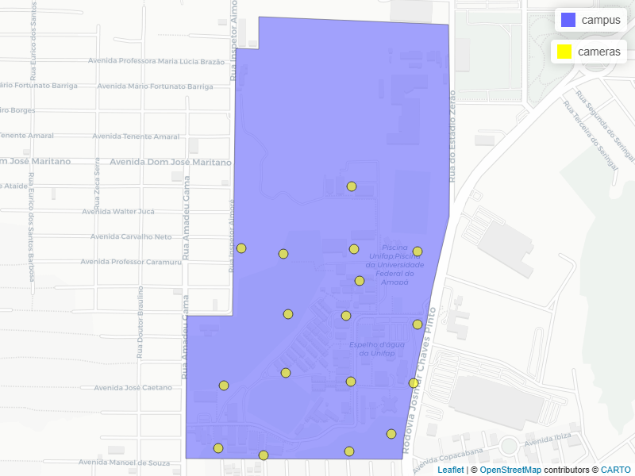

# Quantificando a Estrutura da Paisagem

::: callout-caution
## Capítulo em Desenvolvimento

⚠️ **Aviso:**

Este capítulo é um trabalho em andamento. Os exemplos de código e o texto ainda estão sendo refinados. Você pode encontrar alguns espaços em branco, rascunhos, erros gramaticais, mas estou trabalhando ativamente para finalizá-lo. Feedbacks e sugestões são sempre bem-vindos!
:::

## Apresentação

Neste capítulo, utilizaremos o Campus Marco Zero da UNIFAP como laboratório de estudo. O foco aqui não é a teoria, mas sim como construir um fluxo de trabalho (workflow) eficiente que permita responder perguntas reais: Qual a escala espacial mais relevante para a caracterização da paisagem que estou estudando? Vamos avançar além do cálculo de métricas em pontos isoladas, como fizemos no Capitulo [Métricas da paisagem](https://darrennorris.github.io/epr/cap02.html). Aqui aprenderemos a automatizar a análise de paisagem em múltiplas escalas. Isso permitirá analisar vários pontos em múltiplas escalas simultaneamente.

Para lidar com a complexidade espacial sem nos perdermos tempo em tarefas repetitivas, adotaremos o uso da lógica **Split-Apply-Combine** (Dividir-Aplicar-Combinar) - uma estratégia poderosa para automatizar análises repetitivas. Em vez de calcular métricas manualmente para cada ponto e cada raio de monitoramento, criaremos scripts que automatizam esse processo para locais diferentes e em múltiplas escalas espaciais simultaneamente.

### Objetivos do Capítulo

O objetivo é superar o cálculo manual de métricas e implementar fluxos de trabalho automatizados que permitam analisar múltiplos pontos e escalas simultaneamente. Especificamente você aprenderá a:

1.  **Quantificar a Paisagem**: Calcular métricas de **Diversidade, Composição e Configuração** através do pacote landscapemetrics.

2.  **Analisar o Efeito de Escala**: Construir visualizações que revelam como a caracterização da paisagem muda conforme aumentamos o raio de observação ao redor de um ponto.

3.  **Interpretar Dados para a Fauna**: Traduzir gráficos de métricas espaciais em conclusões biológicas sobre conectividade e qualidade de habitat para espécies especialistas e generalistas.

::: callout-note
Embora este capítulo foque na estrutura física, a quantificação correta da paisagem é o primeiro passo para entendermos a **interação biótica**. Por exemplo, não podemos dizer se um cão evita um gato sem antes entender como ambos **interagem com a matriz urbana** ao seu redor.
:::

## O Conceito: Iteração, Escala e Interação

Um dos maiores desafios na ecologia de paisagens é decidir a "escala de efeito". Em vez de escolhermos um raio arbitrário (ex: 50m), calcularemos métricas em múltiplos raios (12.5m a 100m) para observar como a percepção da paisagem muda para um observador (especie de interesse). Para entender a paisagem, precisamos de pelo menos dois pilares: um técnico (**iteração**) e um teórico (**interação com a escala**).


> **Nota:** É crucial não confundir Iteração (repetição de código) com Interação (relação entre variáveis). Neste capítulo, **iteramos** o código para descobrir como as métricas de paisagem **interagem** com o tamanho do buffer.


#### A Iteração (O "Como fazer")

Na programação, **iterar** significa repetir uma ação para vários elementos. Em vez de escrever o código 17 vezes (uma para cada ponto (câmera)), criamos um fluxo automatizado. Usaremos o pacote purrr para mapear nossas funções sobre os dados, garantindo que a análise seja idêntica para todos os pontos.

Para fazer isso de forma eficiente, adotamos a estratégia Split-Apply-Combine (Dividir-Aplicar-Combinar):

1.  **Split:** Dividimos nossa área de estudo em 17 pontos (armadilhas fotográficas).

2.  **Apply:** Aplicamos a função de cálculo de métricas (`sample_lsm`) a cada ponto em cada escala.

3.  **Combine:** Unimos os resultados em uma única tabela pronta para visualização.

#### A Interação com a Escala (O "Por que fazer")

A paisagem não é estática; ela muda conforme o "zoom" que utilizamos. A **interação entre escala e percepção** é o que define nossos resultados:

1.  **Escalas Locais (Interação de Micro-habitat):** Em raios pequenos (12.5m), interagimos com a vizinhança imediata. Aqui, a paisagem costuma ser mais homogênea (ou é só floresta, ou é só asfalto).

2.  **Escalas de Paisagem (Interação de Mosaico):** Em raios maiores (100m), começamos a captar a interação entre diferentes classes de uso do solo. É nesta escala que percebemos o efeito de borda e a fragmentação.


::: {.callout-tip title="O Duplo Sentido de 'Mapear'" icon="false"}
Na programação funcional, "map" não significa desenhar um mapa geográfico. Significa **associar** cada elemento de um conjunto a uma regra. Quando usamos a função `purrr::map()`, estamos "mapeando" nossas coordenadas geográficas a resultados estatísticos. É o encontro da Álgebra de Mapas de Dana Tomlin [@tomlin1990geographic] com a Ciência da Computação moderna.

**1. O Mapeamento Matemático (A Origem do Código)** Na programação e na matemática, "mapear" (*mapping*) não significa desenhar continentes. Significa **associar rigorosamente cada elemento de um conjunto a um elemento de outro conjunto**. Se tem os números `[1, 2, 3]` e aplica uma regra de "multiplicar por 2", "mapeou" esses valores para um novo conjunto: `[2, 4, 6]`. A função `purrr::map()` faz exatamente isso: pega no nosso conjunto de pontos (conjunto A) e aplica uma função a cada uma delas para gerar um novo conjunto de Métricas (conjunto B).

**2. O Mapeamento Cartográfico (O Espaço Físico)** Na geografia, um "mapa" faz a mesma coisa, mas com o mundo físico. Um cartógrafo "mapeia" o espaço real associando cada árvore, rio ou estrada do mundo tridimensional (conjunto A) a uma coordenada plana de latitude e longitude no papel (conjunto B).

**3. O Encontro na Ecologia da Paisagem** No nosso script, unimos estes dois mundos. Quando corremos o `purrr::map()`, estamos a **mapear matematicamente o nosso mapa espacial**. Pegamos numa localização no espaço real (o *buffer* de 50 metros em redor de uma armadilha fotografica) e transformamo-la num conceito abstrato: um número que representa a caracterisação do espaço (a métrica de paisagem).

Esta mesma lógica é o coração da **Álgebra de Mapas** (criada por Dana Tomlin nos anos 1980 [@tomlin1990geographic]), que é o que o pacote `terra` usa por trás dos panos . Quando somamos dois *rasters* ou os recortamos, o computador está simplesmente a "mapear" uma regra matemática sobre cada pequeno píxel da imagem, transformando o uso do solo em dados quantitativos.
:::

## Preparação: pacotes e dados


### Pacotes

Para reproduzir as análises deste capítulo, você precisará dos seguintes pacotes:

```{r}
#| label: packages-map
#| message: false
#| warning: false

# 1. Project Data
library(eprdados)

# 2. Spatial Engines
library(terra)
library(sf)
library(landscapemetrics)

# 3. Data Manipulation & Grammar
library(tidyverse)

# 4. Analytical Models
library(mgcv)
library(Hmisc)

# 5. Cartography & Visualization
library(tmap)
library(mapview)
```


### Dados.

Os dados utilizados nos exemplos de código provêm dos pacotes. Cópias também estão disponíveis. Arquivos espaciais com mapeamento e classificação da paisagem:

- Camadas vetor [marco_zero_2026_31982.gpkg](https://drive.google.com/file/d/1nRJg6WzIjWlBN0ARdn3CUuJoLCANv1pa/view?usp=sharing) <https://drive.google.com/file/d/1nRJg6WzIjWlBN0ARdn3CUuJoLCANv1pa/view?usp=drive_link>

- Camadas raster na pasta [marco_zero_rasters](https://drive.google.com/drive/folders/1vxEg_MDuo99ysbhQ4AU12sNsvWz1MD8s?usp=sharing) <https://drive.google.com/drive/folders/1vxEg_MDuo99ysbhQ4AU12sNsvWz1MD8s?usp=drive_link>

```{r}
#| label: dados-map
#| message: false
#| warning: false

# Carregando os dados do pacote eprdados
fmz <- system.file("vector/marco_zero_2026_31982.gpkg", package="eprdados")
# load polygon
campus <- st_read(fmz, layer ="campus")
cameras <- st_read(fmz, layer = "ep_species_pa")

```

::: {.content-visible when-format="html"}

### Campus Marco Zero

```{r}
#| label: gerar-imagem-mapa
#| eval: FALSE
#| echo: false
#| message: false
#| warning: false

# Make image for .pdf. Run manually for now.
# 1. Create the 'images' folder if it doesn't already exist
if(!dir.exists("images")) dir.create("images", showWarnings = FALSE)

# 2. Create the map
meu_mapa_campus <- mapview(campus) + mapview(cameras, 
                                             col.regions = "yellow", 
                                             cex = 8)

# 3. Save the image silently.
mapshot2(meu_mapa_campus, file = "images/mapa_estatico.png", 
         remove_controls = c("zoomControl", "layersControl", "homeButton", 
                             "drawToolbar", "easyButton", "control"),
         vwidth = 500, vheight = 400, 
         zoom = 2,
        delay = 5)
```

#### Mapa Campus Marco Zero

A figura abaixo apresenta a distribuição espacial das armadilhas fotográficas. Com mapview você pode explore o mapa interativo abaixo. Você pode utilizar o zoom, arrastar a tela e clicar nos condados para visualizar os valores exatos de cada ponto/polígono.

```{r}
#| label: mapa-interativo
#| eval: !expr knitr::is_html_output()
#| message: false
#| warning: false
#| fig-cap: "Localização das armadilhas fotográficas (cameras) no Campus Marco Zero."

# Criando o mapa interativo
mapview(campus) + mapview(cameras, col.regions = "yellow")
```
:::

::: {.content-visible when-format="pdf"}
#### Mapa Campus Marco Zero

A figura abaixo apresenta a distribuição espacial das armadilhas fotográficas. (Nota: Uma versão interativa deste mapa está disponível na versão online deste livro [Clique aqui para ver o mapa](https://darrennorris.github.io/eprv2/map.html){target="_blank"}). Com mapview você pode explore o mapa interativo abaixo. Você pode utilizar o zoom, arrastar a tela e clicar nos condados para visualizar os valores exatos de cada ponto/polígono.

```{r}
#| label: fig-mapa-estatico
#| eval: !expr knitr::is_latex_output()
#| echo: false
#| message: false
#| warning: false
#| out-width: "80%"
#| fig-cap: "Localização das armadilhas fotográficas (cameras) no Campus Marco Zero."

# knitr grabs the image that was generated in the previous hidden chunk

```
:::



## Métricas da paisagem e pacote "landscapemetrics"

O pacote [landscapemetrics](https://r-spatialecology.github.io/landscapemetrics/){target="_blank"} tem funções para calcular métricas de paisagem em paisagems categóricos (onde tem uma classificação de cobertura de terra/habitat - modelo mancha-corredor-matriz), em um fluxo de trabalho organizado [@Hesselbarth2019]. Existem diversos tutoriais e exemplos no site do proprio pacote: <https://r-spatialecology.github.io/landscapemetrics/> .

### Carregar classificação.

```{r}
#| label: load-class5
#| message: false
#| warning: false
class_5 <- rast(class_5)
plot(class_5)
# Verificamos se o raster é reconhecido pelo landscapemetrics
check_landscape(class_5)

class_3 <- rast(class_3)
plot(class_3)
# Verificamos se o raster é reconhecido pelo landscapemetrics
check_landscape(class_3)
```

### Construindo a Função de Processamento

Antes de escrever codigo para o processamento, precisamos definir e especificar no R algumas valores de referencia importantes.

Especificar a escala (raios).

```{r}
#| label: raios
#| message: false
#| warning: false
# Definimos os raios (buffers) em metros para escala (12.5, 25, 50 e 100).
escalas_metros <- c(12.5, 25, 50, 100)

```

Especificar as métricas.

```{r}
#| label: metricas-desejados
#| message: false
#| warning: false

# métricas desejados
# composição - o que e quanto tem
metrics_comp <- c("lsm_l_ta","lsm_c_cpland", "lsm_c_pland", "lsm_c_ca")
# configuração - "como" classes são organizados e distribuídos no espaço.
metrics_conf <- c("lsm_c_ed", "lsm_c_ai")
# diversidade da paisagem
metrics_div <- "lsm_l_shdi"
what_metricas <- c(metrics_comp, metrics_conf, metrics_div)

```

### Função de Processamento

```{r}
#| label: funcao-metricas
#| eval: FALSE
#| message: false
#| warning: false

# Função para processar cada ponto individualmente
processar_uma_camera <- function(id_alvo, pontos_totais, raster_cheio, 
                                 escalas_alvo) {
  
  # 1. Isola o ponto de interesse / câmera atual
  ponto_atual <- pontos_totais |> filter(instal_ponto == id_alvo)
  
  # 2. Recorta o raster para economizar memória (Crop)
  raio_max <- max(escalas_alvo) + 10
  buffer_local <- sf::st_buffer(ponto_atual, dist = raio_max)
  raster_local <- terra::crop(raster_cheio, terra::ext(buffer_local))
  
  # 3. Itera sobre as escalas (Apply).
  # Calcula as métricas para as três escalas
  # Usamos map_dfr internamente!
  resultados <- purrr::map_dfr(escalas_alvo, function(raio) {
    
    temp <- landscapemetrics::sample_lsm(
      landscape = raster_local, 
      y = ponto_atual,
      plot_id = id_alvo,
      shape = "circle",
      size = raio,       
      what = what_metricas
    )
    
    temp$escala_buffer <- raio # Adiciona a coluna da escala
    return(temp)
    
  })
  
  # 4. Faxina (Obrigatório para o purrr não travar o PC)
  rm(raster_local, buffer_local, ponto_atual)
  gc(verbose = FALSE)
  terra::tmpFiles(current = TRUE, remove = TRUE) 
  
  # Devolve apenas a tabela com resultados
  return(resultados)
}

```

Agora podemos rodar a função com os pontos, raster e raios desejadaos.

```{r}
#| label: calcular-metricas
#| eval: FALSE
#| message: false
#| warning: false

# O fluxo para rodar 
# (17 pontos x 7 métricas x 4 escalas):
tabela_metricas_final <- purrr::map(
  # O 'map' pega cada ID coluna instal_ponto e joga dentro do 1º argumento da função: 'id_alvo'
  .x = cameras$instal_ponto, 
  # a função
  .f = processar_uma_camera, 
  # Argumentos FIXOS da função
  # O 'map' pega esses três dados e os envia exatamente para o 
  # 2º, 3º e 4º argumentos da nossa função, sem alterar nada.
  pontos_totais = cameras,
  raster_cheio = class_3,
  escalas_alvo = escalas_metros,
  # barra de progresso
  .progress =  "Cálculando métricas"
) |> 
  purrr::list_rbind()

#Incluindo os nomes das classes
tabela_fatores <- cats(class_3)[[1]]

tabela_metricas_final <- tabela_metricas_final |>
  left_join(tabela_fatores, by = c("class" = "value")) |>
  # Reorganizando as colunas para o nome da categoria ficar perto do ID
  relocate(class_3, .after = class)

# Export
if(!dir.exists("data")) dir.create("data", showWarnings = FALSE)
write.csv(tabela_metricas_final, 
          "data/tabela_metricas_final.csv", row.names = FALSE)
```

Abordagem split-apply-combine. Sempre que precisarem repetir uma análise para dezenas de polígonos, pontos ou imagens, isolem o que identifica o local no .x. Todo o resto da base de dados espacial (como os rasters) entra como argumento estático logo abaixo. Isso mantém o código limpo, rápido e mais fácil de ler.

Desafio - O Paradigma Split-Apply-Combine em Ecologia Espacial Antes de escrevermos qualquer linha de código, precisamos entender a estratégia que estamos usando para resolver problemas complexos. Em 2011, foi formalizado no R um conceito chamado Split-Apply-Combine (Dividir, Aplicar e Combinar).

A família map() do pacote purrr foi projetada especificamente para iterar sobre essas estruturas complexas com muito mais segurança e velocidade. Ao dominar essa lógica, vocês não estão apenas aprendendo a rodar métricas de paisagem; vocês estão ganhando um modelo mental poderoso que pode ser usado para rodar modelos climáticos, processar milhares de arquivos de áudio, ou analisar grandes bancos de metadados genéticos.

A ideia central é simples: quando um desafio analítico é grande demais ou consome muita memória do computador, nós não tentamos resolvê-lo de uma vez só. Nós o quebramos em três etapas lógicas:

1.  SPLIT (Dividir) Em vez de tentar processar o raster de uso do solo do estado inteiro de uma vez, nós dividimos o problema.

No nosso código: O argumento .x = pontos_sf\$id_ponto faz o Split. Ele separa o nosso conjunto de dados de 17 pontos de amostragem e diz ao computador: "Esqueça o todo; olhe apenas para o Ponto 1 agora".

2.  APPLY (Aplicar) Uma vez que o problema foi reduzido a um pedaço gerenciável, nós aplicamos a nossa análise (a nossa função "trabalhadora") apenas àquele pedaço.

No nosso código: A função processar_uma_camera faz o Apply. Ela pega aquele ponto isolado, recorta um mini-raster (crop) ao seu redor e calcula as métricas (sample_lsm) para as escalas de 25, 50 e 100 metros. O computador faz isso sorrindo, porque processar um único ponto exige quase zero de memória RAM.

3.  COMBINE (Combinar) O R agora tem 17 pequenos resultados flutuando soltos na memória. A etapa final é costurar todos eles de volta em um formato útil.

No nosso código: A função final purrr::list_rbind() faz o Combine. Ela recolhe as 17 pequenas tabelas individuais que foram geradas no passo anterior e as empilha perfeitamente em um único Data Frame final, pronto para ser exportado ou visualizado no ggplot2.

Entendendo a Mágica do purrr::map(): O Dinâmico vs. O Fixo Quando criamos a nossa função processar_uma_camera(), nós definimos que ela precisa de exatamente quatro "ingredientes" para funcionar:

id_alvo: O número da câmera que será processada agora.

pontos_totais: O mapa vetorial com todas as câmeras.

raster_cheio: A imagem contendo o uso do solo.

escalas_alvo: Os raios de extração (25m, 50m, 100m).

O desafio é: nós temos 17 câmeras. Como dizemos ao R para rodar essa função 17 vezes sem termos que copiar e colar o código 17 vezes? É aqui que entra o purrr::map(). Pensem nele como um gerente de uma linha de montagem inteligente que divide os ingredientes entre o que muda e o que fica fixo.

1.  A Esteira Rolante (O Argumento Dinâmico) Observem que dentro do comando map(), nós não escrevemos id_alvo = .... Em vez disso, nós passamos a coluna com todos os IDs para o argumento .x (.x = pontos_sf\$id_ponto).

Essa é a regra de ouro do map: Ele pega todos os itens que você colocou no .x e os entrega, um por um, diretamente no primeiro argumento da sua função. \* Na primeira rodada, o map() pega a Câmera 1 e injeta no id_alvo. A função processa.

Na segunda rodada, ele pega a Câmera 2 e injeta no id_alvo.

Ele funciona como uma esteira rolante, alimentando a função até a lista acabar.

2.  As Ferramentas Constantes (Os Argumentos Estáticos) Os outros três ingredientes (pontos_totais, raster_cheio e escalas_alvo) não mudam nunca. Não importa se o R está processando a primeira ou a última câmera, a imagem de satélite de fundo e as escalas de 25m, 50m e 100m serão exatamente as mesmas.

Por isso, nós escrevemos esses argumentos com seus nomes exatos na parte de baixo do map(). O R entende que eles são ferramentas fixas da bancada de trabalho e os entrega iguazinhos em todas as iterações.

Quando os alunos visualizarem a tabela_resultados, eles encontrarão uma estrutura de dados "tidy" (longa), que é perfeita para o ggplot2. As colunas mais importantes que eles precisam compreender são:

plot_id: Representa qual dos 17 pontos está sendo analisado (o centro do buffer).

class: Qual classe de uso do solo (ex: 1 = Floresta, 2 = Água, 3 = Área Urbana) a linha representa.

metric: O nome da métrica calculada (ex: pland para Percentage of Landscape).

value: O valor matemático da métrica.

escala_buffer: O tamanho da paisagem ao redor do ponto (25, 50 ou 100).

## Análise e Interpretação

### Diversidade

```{r}
#| label: fig-escala-div
#| fig-cap: "Efeito de escala na diversidade da paisagem ao redor das estações de monitoramento fotográfico."
#| out-width: "100%"
#| message: false
#| warning: false
#| 
# Ler o arquivo com metricas
dados_metricas <- read_csv("data/tabela_metricas_final.csv")

# Filtrar os dados
dados_div <- dados_metricas |>
  # Filtrar apenas a métrica de diversidade (shdi)
  filter(metric == "shdi") 

grafico_escala_div <- ggplot(dados_div, 
                                aes(x = escala_buffer, y = value)) +
  # 1. Pontos Brutos
  geom_jitter(alpha = 0.3, width = 1.5, size = 1.5) +
  # 2. Crossbar  
  # Adicionamos aes(group = escala_buffer) LOCALMENTE. 
  # Isso avisa ao ggplot: "Para calcular a média e o bootstrap, agrupe por escala. 
  # Mas não estrague a continuidade do eixo X para o resto do gráfico".
  stat_summary(
    aes(group = escala_buffer), 
    fun.data = "mean_cl_boot", 
    geom = "crossbar", 
    alpha = 0.4, 
    color = "black",       
    linewidth = 0.6
  ) +
  
  # 3. Linha de Tendência (Loess)
  # Como o agrupamento foi isolado no crossbar, o loess consegue enxergar
  # a distância contínua (ex: o salto maior de 50m para 100m) e desenha a curva.
  stat_smooth(
    method = "loess", 
    se = FALSE, 
    linewidth = 1.2,
    color = "black" # Forçamos a linha para preto para destacar sobre os pontos coloridos
  ) +
  scale_color_viridis_d(option = "turbo") +
  scale_fill_viridis_d(option = "turbo") +
  labs(
    title = "Efeito de Escala na Diversidade da Paisagem",
    subtitle = "Variação contínua e tendência (Média ± IC 95%)",
    x = "Raio de Amostragem (metros)",
    y = "Diversidade (Shannon)"
  ) +
  theme_bw() +
  theme(
    legend.position = "none", 
    strip.text = element_text(face = "bold", size = 11),
    # Aumentar a clareza visual mantendo apenas as linhas principais no eixo X
    panel.grid.minor.x = element_blank() 
  )

print(grafico_escala_div)
```

Resultados com o índice de Shannon (métrica SHDI) nos mostra a heterogeneidade da matriz urbana (@fig-escala-div). Existe uma tendencia positiva clara: a diversidade da paisagem aumenta conforme o raio de amostragem se expande de 12,5m para 100m (@fig-escala-div). É importante notar que, neste caso, o aumento da diversidade não é necessariamente positivo do ponto de vista conservacionista. O aumento do Shannon aqui indica a intrusão de elementos antropogênicos (Uso Humano) na vizinhança da vegetação. A "diversidade" aqui é o registro da mudança entre o ambiente natural e o construído.

O limite superior do intervalo de confiaça (IC) para 12,5m termina em aproximadamente 0.28. O limite inferior do IC para 100m começa em aproximadamente 0,30. Como não há sobreposição entre os "crossbars" (IC 95%) desses dois grupos, podemos afirmar com confiança estatística (*p*\<0,05) que a diversidade da paisagem no raio de 100m é significativamente maior que no raio de 12,5m (@fig-escala-div). Muitos pontos apresentam SHDI igual a 0 na escala de 12,5m a 50m (@fig-escala-div). Isso ocorre porque, em um raio curto, a armadilha fotográfica está inserida em uma "mancha pura" (ex: apenas Cerrado Antrópico ou apenas Uso Humano). A paisagem é homogênea e monótona. Na escala de 100m O valor médio de Shannon sobe para aproximadamente 0,42, com picos atingindo 0,70 (como nos pontos LO_07_0100 e LO_07_0700). Nesta escala, o círculo de amostragem é grande o suficiente para captar a transição entre diferentes classes (ex: o fragmento de vegetação + a calçada).

Os pontos com SHDI alto (perto de 0,7) na escala de 100m são zonas de borda ativa. Estes locais podem atrair animais que utilizam a vegetação para abrigo, mas buscam recursos na matriz urbana (como restos de alimentos humanos ou presas sinantrópicas, como ratos e pombos). A baixa diversidade nas escalas menores (12,5m) confirma que a câmera está "dentro" de um tipo de cobertura. Se um animal é registrado em um ponto onde o Shannon é 0 (escala 12,5m) mas sobe para 0,6 (escala 100m), você tem a prova quantitativa de que aquela espécie está utilizando um fragmento pequeno e altamente influenciado pelo entorno urbano.

### Composição

Se o pacote de ecologia espacial simplesmente omite a linha quando a classe não existe no buffer (em vez de reportar 0), a função mean() do R calcula a média apenas para os locais onde a classe estava presente. Isto inflaciona artificialmente os valores de pland e cpland, criando a ilusão de que o campus tem muito mais cobertura do que realmente tem.

```{r}
#| label: fig-escala-comp
#| fig-cap: "Efeito de escala na composição da paisagem ao redor das estações de monitoramento fotográfico. A linha contínua negra representa a tendência espacial suavizada (LOESS) da proporção de cobertura, enquanto as barras indicam a média e o intervalo de confiança de 95% (bootstrap) para os raios de amostragem. Os quadros estão ordenados da classe de uso do solo mais dominante para a menos dominante acerca das estações de monitoramento."
#| out-width: "100%"
#| message: false
#| warning: false


# Limpar e filtrar os dados
dados_prop <- dados_metricas |>
  # Filtrar apenas a métrica de porcentagem da paisagem (cpland)
  filter(metric %in% c("cpland", "pland")) |>
  # Remover linhas que não têm classe definida (ex: métricas de nível de landscape)
  filter(!is.na(class_3)) |> 
  tidyr::complete(plot_id, escala_buffer, metric, class_3, fill = list(value = 0))

# Grafico
grafico_escala_efeito <- ggplot(dados_prop, 
                                aes(x = escala_buffer, y = value, 
                                    color = class_3, fill = class_3)) +
  # 1. Pontos Brutos
  geom_jitter(alpha = 0.3, width = 1.5, size = 1.5) +
  # 2. Crossbar  
  # Adicionamos aes(group = escala_buffer) LOCALMENTE. 
  # Isso avisa ao ggplot: "Para calcular a média e o bootstrap, agrupe por escala. 
  # Mas não estrague a continuidade do eixo X para o resto do gráfico".
  stat_summary(
    aes(group = escala_buffer), 
    fun.data = "mean_cl_boot", 
    geom = "crossbar", 
    alpha = 0.4, 
    color = "black",       
    linewidth = 0.6
  ) +
  
  # 3. Linha de Tendência (Loess)
  # Como o agrupamento foi isolado no crossbar, o loess consegue enxergar
  # a distância contínua (ex: o salto maior de 50m para 100m) e desenha a curva.
  stat_smooth(
    method = "loess", 
    se = FALSE, 
    linewidth = 1.2,
    color = "black" # Forçamos a linha para preto para destacar sobre os pontos coloridos
  ) +
  facet_grid(metric ~ fct_reorder(class_3, value, .fun = mean, .desc = TRUE)) +
  scale_color_viridis_d(option = "turbo") +
  scale_fill_viridis_d(option = "turbo") +
  labs(
    title = "Efeito de Escala na Composição da Paisagem",
    subtitle = "Variação contínua e tendência (Média ± IC 95%)",
    x = "Raio de Amostragem (metros)",
    y = "Proporção na Paisagem (%)"
  ) +
  theme_bw() +
  theme(
    legend.position = "none", 
    strip.text = element_text(face = "bold", size = 11),
    # Aumentar a clareza visual mantendo apenas as linhas principais no eixo X
    panel.grid.minor.x = element_blank() 
  )

print(grafico_escala_efeito)
```

Num ecossistema silvestre intacto, a floresta contínua é a matriz, e as estradas ou clareiras humanas são os fragmentos isolados. Em areas urbanas inclusive no campus Marco Zero, ocorre exatamente o inverso: o ambiente construído (Uso Humano) é o único espaço contínuo e geometricamente íntegro, enquanto a natureza (Cerrado Antrópico) foi reduzida a recortes altamente permeáveis (@fig-escala-comp). Isto cria um habitat instável e inadequado para espécies silvestres sensíveis, mas extremamente favorável para a fauna sinantrópica que explora as margens da infraestrutura.

A área núcleo quantificada atraves a métrica cpland não mede apenas a presença física de uma cobertura (como faz o pland), mas testa a sua integridade geométrica, descontando as zonas de transição (efeito de borda). Os valores de área núcleo do uso humano mantêm-se invariavelmente elevados, registando médias acima de 50% em raios de 25 metros ou mais (@fig-escala-comp). Isto prova matematicamente que as infraestruturas e áreas de atividade humana não estão fragmentadas. O uso humano funciona como a "matriz imperturbável" do campus, dominando a paisagem com áreas interiores (núcleo) isoladas de outras classes.

O "Cerrado Antrópico" da UNIFAP, embora presente nos pontos de amostragem, carece de integridade estrutural. Nas escalas menores (12,5m e 25m), o pland frequentemente atinge valores próximos a 100% (ex: Pontos LO_01_0000 e LO_05_0400). Isso ocorre porque a armadilha está fisicamente dentro da mancha de vegetação. No entanto, ao expandir para a escala de 100m, o pland cai drasticamente para valores como 15,05% (Ponto LO_01_0600) ou 5,74% (Ponto LO_07_0300). Enquanto a área total da classe diminui com a escala, o cpland (Core Area) permanece consistentemente baixo. Em muitos pontos, a área de núcleo é quase nula em relação à complexidade da matriz circundante.

A manutenção de valores baixos de cpland sugere que a maior parte do Cerrado Antrópico no campus é composta por "bordas". Em ecologia de paisagem, quando o cpland é significativamente menor que o pland, entende-se que o fragmento é excessivamente alongado ou pequeno demais para manter condições de interior (microclima estável, menor ruído, menor incidência de espécies invasoras ou domésticas).

A redução expressiva do pland ao aumentar o raio de amostragem demonstra que as manchas de Cerrado são pequenas e estão imersas em uma matriz dominante de "Uso Humano" (edificações, asfalto, áreas desmatadas). No Campus Marco Zero, isso reflete a pressão da infraestrutura universitária sobre os remanescentes naturais. A paisagem deixa de ser "Cerrado com interferência" para se tornar "Urbanização com fragmentos de Cerrado".

### Configuração

```{r}
#| label: fig-escala-conf
#| fig-cap: "Efeito de escala na configuração da paisagem ao redor das estações de monitoramento fotográfico. A linha contínua negra representa a tendência espacial suavizada (LOESS) da proporção de cobertura, enquanto as barras indicam a média e o intervalo de confiança de 95% (bootstrap) para os raios de amostragem. Os quadros estão ordenados da classe de uso do solo mais dominante para a menos dominante acerca das estações de monitoramento."
#| out-width: "100%"
#| message: false
#| warning: false


# Limpar e filtrar os dados
dados_conf <- dados_metricas |>
  # Filtrar apenas a métrica de porcentagem da paisagem (cpland)
  filter(metric %in% c("ai", "ed")) |>
  # Remover linhas que não têm classe definida
  filter(!is.na(class_3)) 

# Grafico
grafico_escala_conf <- ggplot(dados_conf, 
                                aes(x = escala_buffer, y = value, 
                                    color = class_3, fill = class_3)) +
  # 1. Pontos Brutos
  geom_jitter(alpha = 0.3, width = 1.5, size = 1.5) +
  # 2. Crossbar  
  # Adicionamos aes(group = escala_buffer) LOCALMENTE. 
  # Isso avisa ao ggplot: "Para calcular a média e o bootstrap, agrupe por escala. 
  # Mas não estrague a continuidade do eixo X para o resto do gráfico".
  stat_summary(
    aes(group = escala_buffer), 
    fun.data = "mean_cl_boot", 
    geom = "crossbar", 
    alpha = 0.4, 
    color = "black",       
    linewidth = 0.6
  ) +
  
  # 3. Linha de Tendência (Loess)
  # Como o agrupamento foi isolado no crossbar, o loess consegue enxergar
  # a distância contínua (ex: o salto maior de 50m para 100m) e desenha a curva.
  stat_smooth(
    method = "loess", 
    se = FALSE, 
    linewidth = 1.2,
    color = "black" # Forçamos a linha para preto para destacar sobre os pontos coloridos
  ) +
  facet_grid(metric ~ class_3, scales = "free_y") +
  scale_color_viridis_d(option = "turbo") +
  scale_fill_viridis_d(option = "turbo") +
  labs(
    title = "Efeito de Escala na Configuração da Paisagem",
    subtitle = "Variação contínua e tendência (Média ± IC 95%)",
    x = "Raio de Amostragem (metros)",
    y = "Valores"
  ) +
  theme_bw() +
  theme(
    legend.position = "none", 
    strip.text = element_text(face = "bold", size = 11),
    # Aumentar a clareza visual mantendo apenas as linhas principais no eixo X
    panel.grid.minor.x = element_blank() 
  )

print(grafico_escala_conf)
```

A configuração da paisagem do Campus Marco Zero (@fig-escala-conf) revela que os remanescentes de Cerrado e Campo Sujo possuem alta coesão interna (AI ≈ 95%), mas sofrem com uma severa pressão de borda nas escalas locais, especialmente o Campo Sujo (ED \> 400 m/ha). A redução do ED com o aumento da escala espacial demonstra que a complexidade estrutural da vegetação é rapidamente substituída pela homogeneidade da matriz construída, caracterizando um cenário de fragmentação onde os habitats naturais funcionam como ilhas compactas sob forte influência externa.

O indicie de aggregação (AI) mede o quão próximos ou "agrupados" estão os pixels de uma mesma classe (vai de 0 a 100%).Em todas as classes (Campo Sujo, Cerrado Antrópico e Uso Humano), o AI é extremamente alto e estável (próximo a 100%). Isso indica que a vegetação no campus não está distribuída de forma "salpicada" ou fragmentada em minúsculos pontos isolados (como gramados raleados). Pelo contrário, onde a vegetação existe, ela forma blocos compactos - pelo menos com uma classificação em 3 classes.

O Densidade de Borda (ED) mede a quantidade de bordas (contato entre diferentes classes) em relação à área total (metros por hectare). É um dos principais indicadores de fragmentação. Campo Sujo (O mais fragmentado), apresenta os valores de ED mais altos na escala local (12,5m), chegando a 400-600 m/ha. Isso mostra que as áreas de Campo Sujo são manchas menores ou com formatos muito irregulares, onde quase tudo é "borda". Conforme o raio aumenta para 100m, o ED cai para \~150 m/ha, indicando que essas manchas estão imersas em uma matriz que "dilui" essa borda. Para o classe de Uso Humano (a matriz estável) o ED é o mais baixo e estável (perto de 100 m/ha). Isso ocorre porque as áreas construídas no campus (blocos, estacionamentos) tendem a ter formatos geométricos e contínuos, gerando menos "perímetro de borda" por unidade de área do que a vegetação natural, que é mais irregular.

### Correlações entre métricas

Para modelos inferenciais (como GLM, GAM etc), a referência na ecologia é: @dormann_collinearity_2013 - "Collinearity: a review of methods to deal with it and a simulation study evaluating their performance". Este estudo testou diversos métodos e concluiu que uma correlação entre variavies de r\>0.7 é o ponto onde as estimativas dos coeficientes tornam-se instáveis e o erro do modelo aumenta significativamente. Assim sendo, correlação entre variavies de r\>0.7 se torno um dos criterios objetivos para identificar varieveis redundantes.

O bloco de código abaixo calcula correlações aos pares e gera gráficos para facilitar a comparação das correlações entre as diferentes métricas.

```{r}
#| label: make-correlations
#| message: false
#| warning: false

# 1. Prepare data
# Filtering for landscape level metrics; pivot so metrics are columns
landscape_wide <- dados_metricas |>
  filter(level == "landscape") |>
  select(plot_id, escala_buffer, class_3, metric, value) |>
  pivot_wider(names_from = metric, values_from = value)


# Filtering for class level metrics; pivot so metrics are columns
class_wide <- dados_metricas |>
  filter(level == "class") |>
  select(plot_id, escala_buffer, class_3, metric, value) |>
  pivot_wider(names_from = metric, values_from = value)

cor_results_l <- landscape_wide |>
  group_by(escala_buffer) |>
  nest() |>
  mutate(cor_mat = map(data, ~ {
    # Select only numeric columns (metrics)
    numeric_data <- .x |> select(where(is.numeric))
    
    # Calculate correlation matrix using base R
    # use = "pairwise.complete.obs" handles any NAs safely
    res_matrix <- cor(numeric_data, use = "pairwise.complete.obs")
    
    # Convert matrix to a tidy data frame
    res_matrix |> 
      as.data.frame() |> 
      rownames_to_column(var = "metric_name")
  })) |>
  # Remove the raw 'data' column and expand the correlation results
  select(-data) |> 
  unnest(cor_mat)
# View the numeric results
print(cor_results_l)

cor_results_class <- class_wide |>
  group_by(escala_buffer) |>
  nest() |>
  mutate(cor_mat = map(data, ~ {
    # Select only numeric columns (metrics)
    numeric_data <- .x |> select(where(is.numeric))
    
    # Calculate correlation matrix using base R
    # use = "pairwise.complete.obs" handles any NAs safely
    res_matrix <- cor(numeric_data, use = "pairwise.complete.obs")
    
    # Convert matrix to a tidy data frame
    res_matrix |> 
      as.data.frame() |> 
      rownames_to_column(var = "metric_name")
  })) |>
  # Remove the raw 'data' column and expand the correlation results
  select(-data) |> 
  unnest(cor_mat)

# View the numeric results
print(cor_results_class)

```

Visualizar em um grafico.

```{r}
#| label: fig-correlations
#| fig-cap: "A fazer. "
#| message: false
#| warning: false

# 1. Prepare the data for plotting
# We convert the wide columns into a long 'metric_pair' column
cor_plot_data <- cor_results_class |>
  pivot_longer(
    cols = -c(escala_buffer, metric_name), 
    names_to = "metric_pair", 
    values_to = "r"
  )

# 2. Create the Heatmap Plot
ggplot(cor_plot_data, aes(x = metric_name, y = metric_pair, fill = r)) +
  geom_tile(color = "white") + # White borders for tiles
  # Add numeric labels to each tile for clarity
  geom_text(aes(label = round(r, 2)), size = 3, color = "black") +
  # Use a diverging color scale (Red = Positive, Blue = Negative)
  scale_fill_gradient2(
    low = "#313695", mid = "white", high = "#a50026", 
    midpoint = 0, limit = c(-1, 1), 
    name = "Pearson\nCorrelation"
  ) +
  # Create a separate panel for each scale
  facet_wrap(~escala_buffer, labeller = label_both) +
  theme_minimal() +
  labs(
    title = "Correlações de métricas da paisagem por escala de buffer",
    subtitle = "Identificação de colinearidade (r > 0,7) para selecionar as métricas finais",
    x = NULL, y = NULL
  ) +
  theme(
    axis.text.x = element_text(angle = 45, vjust = 1, hjust = 1),
    panel.grid = element_blank() # Clean look for heatmaps
  ) +
  coord_fixed() # Makes tiles perfectly square


```

Muitas valores nos resultados da Matriz de Correlação (@fig-correlations).

::: callout-note
## Nota sobre escala

Observe que no seu gráfico de 100m, os quadrados estão muito mais "claros" (cores mais fracas), exceto entre pland e cpland. Isso indica que, conforme você aumenta o buffer, as métricas tornam-se mais independentes uma da outra.
:::

Para ajudar indentificar valores de correlação mais importantes podemos fazer um resumo.

```{r}
# 1. Create the summary table
cor_summary <- cor_plot_data |>
  # Remove self-correlations (e.g., ai vs ai)
  filter(metric_name != metric_pair) |>
  # Ensure "Metric A - Metric B" and "Metric B - Metric A" are treated as the same pair
  mutate(pair = ifelse(metric_name < metric_pair, 
                       paste(metric_name, metric_pair, sep = " - "), 
                       paste(metric_pair, metric_name, sep = " - "))) |>
  # Group by the pair to calculate stats across all scales (escala_buffer)
  group_by(pair) |>
  dplyr::summarize(
    mean_correlation = mean(r, na.rm = TRUE),
    min_correlation  = min(r, na.rm = TRUE),
    max_correlation  = max(r, na.rm = TRUE)
  ) |>
  # Keep only unique pairs
  distinct() |> 
  mutate(flag_co = ifelse((abs(max_correlation)> 0.699|
                             abs(min_correlation)> 0.699), 
                          "colinearidade", ""))

print(cor_summary)
```

Com base no gráfico de calor (@fig-correlations) e na tabela cor_summary, tem um caso claro de redundância nas métricas.

1.  O Grupo Redundante (Área)\
    As métricas ca (Class Area), pland (Percentage of Landscape) e cpland (Core Area Percentage of Landscape) estão altíssimamente correlacionadas entre si em todas as escalas (r entre 0,94 e 0,98). À medida que a área total da classe aumenta, a porcentagem da paisagem e a área de núcleo aumentam quase perfeitamente juntas.\
    **Decisão:** Escolha apenas UMA destas. **Recomendação:** Fique com a pland. É a métrica padrão na literatura científica por ser normalizada (0-100%) e facilitar a comparação entre áreas de tamanhos diferentes.

2.  A Métrica de Configuração (ai)\
    O ai (Aggregation Index) tem correlações moderadas com a área (r≈0,51 a 0,55). Isso é bom. Significa que o ai traz uma informação nova que a quantidade de área não explica: se as manchas estão muito próximas/agrupadas ou dispersas.\
    **Decisão:** Mantenha o ai. Ele é importante para explicar a conectividade estrutural.

3.  A Métrica de Borda (ed)\
    O ed (Edge Density) apresenta um comportamento interessante de dependência de escala. Na escala de 12.5m, ele é fortemente correlacionado negativamente com a área (r=−0.86). Na escala de 100m, essa correlação cai para quase zero (r=−0.12). Em escalas pequenas, a borda e a área estão ligadas de forma simples. Em escalas maiores, a paisagem se torna mais complexa e a densidade de bordas passa a ser independente da quantidade de área.\
    **Decisão:** Mantenha o ed. Ele será crucial para capturar a fragmentação em escalas maiores que a métrica de área (pland) não percebe.

#### Resumo: Quais métricas manter no seu modelo final?

Para evitar problemas de multicolinearidade em análises futuras, eu recomendo manter 3 métricas de class:

- pland (Representa a Quantidade: quanto de habitat existe).

- ai (Representa a Agregação: como esse habitat está agrupado).

- ed (Representa a Borda: quanta interface/ecotone existe com a matriz).

O que descartar? Descarte ca e cpland, pois a pland já explica quase 100% da variação delas. Foram incluidos para gerar resumos, e não precisa incluir-las nas analises.

## Implicações para a Fauna

- Espécies Especialistas:\
  Provavelmente estão ausentes ou apenas de passagem, pois não encontram "área de núcleo" (cpland) suficiente para estabelecer território ou reprodução segura.

- Espécies Generalistas/Sinantrópicas:\
  São favorecidas. A baixa área de núcleo e a alta permeabilidade da matriz urbana facilitam a presença de espécies que toleram a presença humana (ex: roedores sinantrópicos).

- Conectividade:\
  O Cerrado Antrópico no campus funciona mais como stepping stones (pontos de parada) do que como um corredor ecológico funcional, devido à rápida perda de representatividade (pland) em escalas espaciais maiores.

## Conclusão

As análises demonstram que a estrutura da paisagem no Campus Marco Zero é dependente da escala. Abaixo de 50 metros, a variabilidade numérica é insuficiente para modelos ecológicos robustos. O que parece um "bloco de vegetação" em uma análise de curto alcance (12,5m), revela-se uma paisagem multifacetada em escala de 100m. Para a fauna, isso significa que não existem refúgios isolados da influência urbana; todo animal que transita pelo campus está a poucos metros de uma mudança na composição da paisagem.

Para entender os processos ecológicos no campus Marco Zero que dependam minimamente de áreas naturais, uma escala de pelo menos 50 metros é o limite mínimo viável.

Aqui estão os dois motivos técnicos que fundamentam a conclusão:

Estatisticamente viavel:\
Abaixo de 50 metros (nos raios de 12,5m e 25m), a área núcleo de Cerrado (cpland) para muitas câmaras é pura e simplesmente zero. Estatisticamente, é impossível calcular se um animal prefere a vegetação se a sua variável de habitat for apenas uma coluna cheia de zeros. Ao alargar para 50 metros, o cpland atinge o seu pico de representatividade (cerca de 24,8% de média), introduzindo a variabilidade numérica mínima necessária para os modelos funcionarem.

O Comportamento do Animal:\
Uma escala de 50 a 100 metros reflete a realidade de que um animal \> 500g dentro do campus precisa de "caminhar mais" ou "olhar mais longe" para encontrar um fragmento seguro. Ele não toma a decisão de forragear com base nos 10 metros ao seu redor (que são puramente borda e perturbação), mas sim avaliando o polígono maior.

Esta escolha de mais de 50 metros é geral e não leva em conta as características dos animais. Se o seu objetivo for modelar a presença de cães errantes, gatos ou pombos (fauna sinantrópica), escalas menores de 25 metros continuam a ser potencialmente explicativas, porque esses animais podem tomam as suas decisões baseados na presença imediata de infraestrutura e calçadas.
